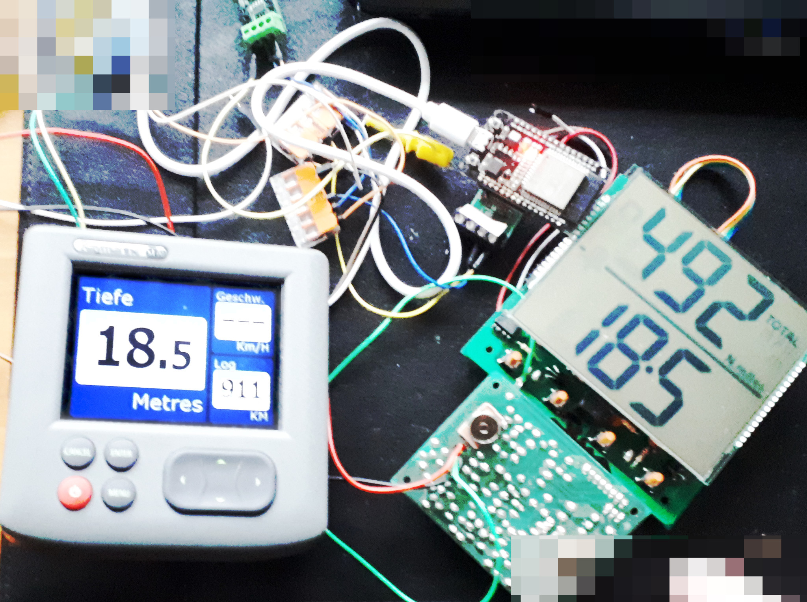
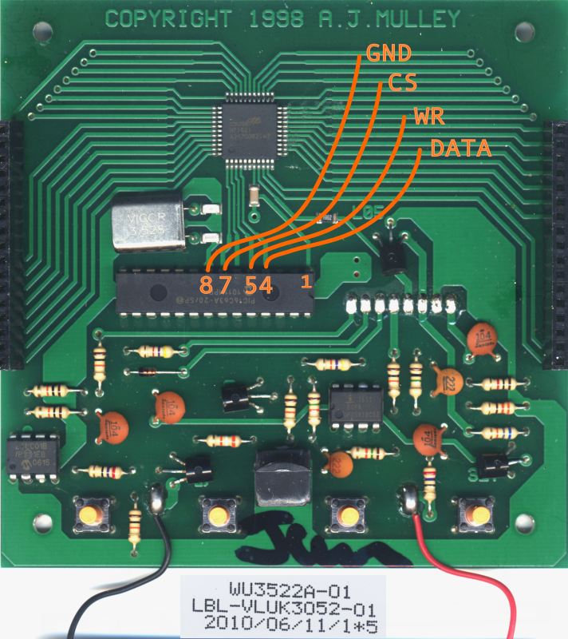
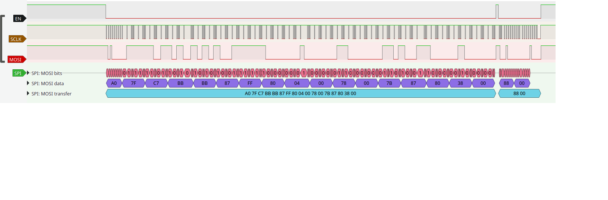
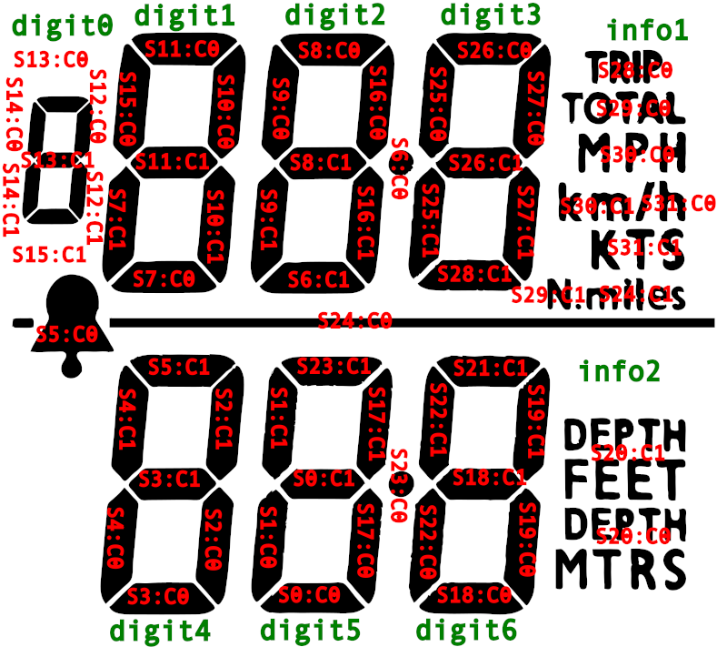

# NASA Clipper Duet Echo Sounder/Log to NMEA2000 converter (__ClipperDuet2N2k__) :sailboat: :hammer_and_wrench

## Intro

__ClipperDuet2N2k__ project is about retrofitting[^1] a NASAmarine Clipper Duet echo sounder/log with NMEA2000.

It makes use of an ESP32 equipped with a CAN transceiver to read the LCD controller's data and recompute usable values for water depth, speed and distance logs to be send into the NMEA2000 CAN network.

See my chaotic test setup[^2] below:

## HOWTO

### Prerequisites

Hardware needed:

* [NASAmarine Clipper Duet](http://web.archive.org/web/20230130133611/https://www.nasamarine.com//wp-content/uploads/2015/12/Clipper-Duet.pdf) (in case there are different versions arund: the LCD controller must be an HT1621 and the LCD segment/com layout must be the same as in this implementation)
* ESP32 module with a CAN transceiver[^3]
* a power supply module for the ESP32 which runs with the ca. 12V of your boat. It should deliver either 5V or 3.3V depending on your ESP32 module

Software needed:

* __ClipperDuet2N2k__ firmware (maybe as an already compiled binary ready for upload)
* some means of uploading the firmware to the ESP32

The firmware is written for the ESP32. It makes use of PlatformIO with the Arduino framework.

Additional libraries:

* [NMEA2000 library by Timo Lappalainen](https://github.com/ttlappalainen/NMEA2000/)
* [ESP32SPISlave library by Hideaki Tai](https://github.com/hideakitai/ESP32SPISlave) (this one is included for convenience, as it is not rolled out via PlatformIO)

### Clipper Duet modification

You need to attach SPI MOSI, CLK, CS and GND wires of the ESP32 to the Clipper Duet front pcb.

The front pcb from the front side (just for reference):

It's easiest to directly solder wires to the pins of the through-hole technique PIC microcontroller _on the back side_ of the front pcb.

It is unknown if there are different hardware revisions of the Clipper Duet around. Check yours to have the same ht1621 type of LCD controller and the same LCD layout.

The firmware expects these connections (Arduino style pin numbering):

* GPIO_NUM_13 (SPI MOSI) to HT1621 DATA which is on pin 4 of the PIC
* GPIO_NUM_12 (SPI MISO) stays unconnected
* GPIO_NUM_14 (SPI CLK) to HT1621 WR which is pin 5 of the PIC
* GPIO_NUM_27 (SPI CS) to HT1621 CS which is pin 7 on the PIC
* GND of the ESP32 is connected to GND on the Clipper Duet, this can be found e.g. on pin 8 of the PIC
* CAN transceiver TX pin is on GPIO_NUM_5 of the ESP32
* CAN transceiver RX pin is on GPIO_NUM_4 of the ESP32

The ESP32 is experienced to have 5V tolerance on the GPIO pins above. Considering the cheapness of the ESP32 modules, there is no level converter used.

A power supply for the ESP32 is needed. Most ESP32 modules want either 3.3V or 5V. The on-board 5V regulator of the Clipper Duet should not be used, as the ESP32 could draw too much power even without WIFI - YMMV.

### First start

__ClipperDuet2N2k__ firmware needs no special setup or configuration by the user.

Before real use, you should have at least once set your Clipper Duet into configuration mode (hold Illum key depressed while powering on) and confirm all the adjustments (keel offset, gain threshold, paddle wheel calibration value, units).
__ClipperDuet2N2k__ will read those settings and save it into its non-volatile memory, so that settings like the keel offset are known to the unit and can be sent in NMEA2000 sentences.

__Without this configuration step, a keel offset of -3m is used as default for safety.__

### Usage

__ClipperDuet2N2k__ will send NMEA2000 sentences for depth, speed, trip and total log.

Other NMEA2000 devices like chart plotters or MFDs are able to display these values. The units used on the NASA Clipper Duet can be adjusted to free will, values will automatically be converted to the base units of the respecticve NMEA2000 sentences.

Due to the nature of implementation, only the values shown are constantly sent out via NMEA2000. As unit conversion takes place using double float values, there might be minor rounding errors. This choice was made to ease development, as the NMEA2000 library also uses double floats.

Invalid water depth readings shown as "out" on the Clipper Duet are also sent as invalid value on NMEA2000, so other bus devices can detect false or missing readings.
The keel offset configured in your Clipper Duet is sent as a negative offset in the water depth NMEA2000 sentence (your frontend display will most likely automatically account for this offset).

Beware that the update rate of the Clipper Duet and the small delay during data preparation adds up to the display delays on your frontend device. Also there are some bad implementations by some manufactures who preferred nice rolling values over fast update rates.

The trip and total distance log are sent in one NMEA2000 sentence. When showing the trip value, the trip distance and the last known total log are sent. When showing the total log, the trip and total values are sent only if they have been displayed less than 60s apart. If a the unit has read a system time/GNSS time (PGN 126992, 129029) from the NMEA2000 bus, this time is used to form a timestamp for the distance log sentence.

Configuration and calibration is done as usual by manually adjusting the settings via the buttons on the NASA Clipper Duet. Setting changes in the Clipper Duet are read by the __ClipperDuet2N2k__ (see "First start").

For convenience, NMEA2000 traffic is output on the serial port in ActiSense format. So the __ClipperDuet2N2k__ could be also used as a NMEA2000 to (USB-)serial gateway (with or without being connected to a Clipper Duet).

## Implementation insights

The PIC microcontroller of the Clipper Duet tells the HT1621 LCD controller which segments should be on depending on the values to be displayed.

The segment/com lines have been explored by writing a test software which make the LCD controller highlight single segments, so that a map of the segments and common planes could be made.

The ESP32 reads the communications of the PIC microcontroller with the HT1621. The PIC periodically sends data for the entire display memory of the LCD controller.

__ClipperDuet2N2k__ ESP32 maps this display memory back to the 5 digits plus some symbols. The digits and symbols are then used to deduce the values, units and state of the Clipper Duet. The assembled data is then translated into standard NMEA2000 sentences and written to the CAN bus.

Shallow depth and speed alarm settings are read by the __ClipperDuet2N2k__, but as there is no well-known NMEA2000 PGN, no sentence with these values is sent.

## Firmware Development Info

Versioning scheme is major.minor.patch
Version data is included via the `version.py` pre:-script run by PlatformUIO

The N2K software version is shown as

* major.minor.patch.0 for tags
* major.minor.patch.num_of_additional_commits for commits
* 0.major.minor.patch for a "dirty" build

N2k software version also shows build date.
The format seems to be the one which is used in Timo Lappalainen's library, so I'll stick to it.

A full "git describe --allways --dirty" version string is included in the binary in NMEA2000.SetInstallationDescription1.

## Hardware Development Info

Clipper Duet is a simple device which is more on the cheaper end of the price range of depth sounders.
__ClipperDuet2N2k__ accounts for this and tries to keep things simple.

Following this KISS principle, the hardware was just thrown together using modules which were lying around.

## Footnotes

[^1]: I reverse-engineered the schematics and partially recreated the PCBs in KiCAD. Link will follow once I uploaded this.

[^2]: The test setup consisted of a NASA Clipper Duet with an ESP32 devboard connected via a CAN transceiver to a marine MFD (in this case a Raymarine St70, which btw. is not recommended due to a number of bugs).

[^3]: A [TI SN65HV231](https://www.ti.com/lit/ds/symlink/sn65hvd230.pdf) was used, as it operates on 3.3V
