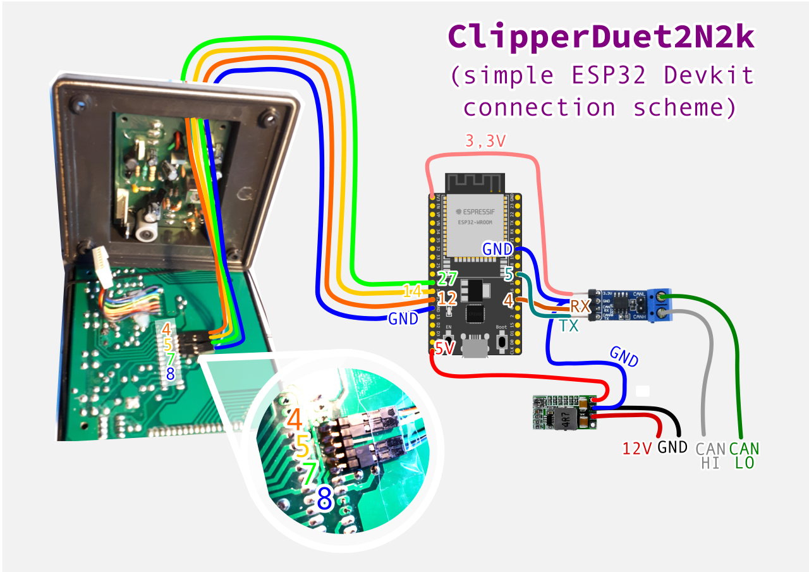

# __ClipperDuet2N2k__ - Clipper Duet NMEA2000 Erweiterung

## Vorwort

Das NASAmarine Clipper Duet Kombiinstrument mit Echolot und Logge ist ein in den 1990er-Jahren entwickeltes Gerät, welches nahezu unverändert bis heute gebaut wird.

Die Technik ist mittlerweile ein wenig in die Jahre gekommen, dennoch scheint das Gerät noch weit verbreitet zu sein.

Diese Baubeschreibung des __ClipperDuet2N2k__ zeigt den Umbau eines NASAmarine Clipper Duet Echolots/Logge, um mit Hilfe eines ESP32 Mikrokontrollers eine NMEA2000[^1] kompatible Schnittstelle (weiterhin N2k genannt) für die Ausgabe von Tiefe, Geschwindigkeit und Tages-/Gesamtlog auf Plotter/MFDs/etc. zu schaffen.

## Funktionsweise des Umbaus

Der ESP32 Mikrocontroller liest mit, welche Segmente auf dem LCD angezeigt werden. Hierzu "belauscht" er die Kommunikation des PIC-Mikrocontrollers auf dem Clipper Duet mit dem LCD-Treiber-Chip (HT1621) und rechnet zurück, welche Werte angezeigt werden.

Diese Werte werden dann in die Basiseinheiten der N2k Daten für Tiefe, Geschwindigkeit und Tages-/Gesamtlog umgerechnet und über den CAN-Bus in das N2k Netz gesendet.

## Umbau des Clipper Duet Echolot/Logge auf NMEA2000 Kommunikation

Für die Erweiterung um N2k werden benötigt:

* NASAmarine Clipper Duet in einer Hardwareversion, die der abgebildeten entspricht
* ESP32 Devkit o.ä.
* CAN-Transceiver-Modul, idealerweise mit 3,3V Betriebsspannung (z.B. SN65HVD231)
* Spannungsregler-Modul 12V auf 5V [^2]
* ein wenig Schaltlitze, um die Verbindungen nach aussen zu führen
* Lötequipment
* Kreuz-Schraubendreher PH1

 Aufgrund der berichteten 5V-Toleranz der IO-Pins des ESP32 wird (auch im Hinblick auf den geringen Preis) auf Level-Konverter zur Spannungsanpassung verzichtet.

### Clipper Duet öffnen

Der Clipper Duet wird mittels der 4 Schrauben auf der Rückseite (PH1 Kreuz-Schraubendreher) geöffnet.

Das Verbindungskabel zwischen hinterer und vorderer Platine wird nun abgesteckt.

__Hinweis:__
Die Litzen sind im Bereich der Verlötung mit der Frontplatine sehr steif und neigen zum Brechen.
Also kontrollieren, ggf. nachlöten und Litzen vielleicht auch mit Heißkleber festsetzen, so dass sie nicht im Bereich der Lötstellen bewegt werden können (sh. Bild).

### Litzen anlöten

Auf der Rückseite der Frontplatine des Clipper Duet werden die Verbindungen zum ESP32 angelötet.

Mittig auf der Platine sind die beiden Beinchenreihen des PIC Mikrocontrollers zu sehen.

Pin 1 befindet sich auf dem folgenden Foto links oben.

An Pins 4, 5, 7 und 8 werden Litzen - oder wie hier - Pinheader für "Dupont"-Verbinder angelötet.

Pinbelegung am PIC:

* (ungenutzt) 1: 5V
* 4: Data (als "SPI MOSI" an GPIO_12 des ESP32-Boards)
* 5: Clock ((als "SPI CLK" an GPIO_14 des ESP32-Boards))
* 7: Chip-Select ((als "SPI CS" an GPIO_27 des ESP32-Boards))
* 8: Ground (an GND vom ESP32-Board), liegt bei Verwendung eines Pinheaders praktisch

Das Klebeband verhindert das Verrutschen beim Löten.

### Litzen nach aussen führen

Die hintere Platine ist im Gehäuse mit 4 Kreuz-Schrauben befestigt.

Um die Litzen durch das Gehäuse nach aussen führen zu können, wird die Platine entfernt.
Das Durchführungsloch für die bereits existierenden Litzen (rot=12V/+, schwarz=GND/- und grün=Alarm) wird ggf. vergrößert (Gummistopfen als Schutz).

Dann werden die Litzen am Rand der hinteren Platine entlang nach aussen gelegt.

Das Clipper Duet kann nun wieder zusammengebaut werden.

__Achtung:__
Ggf. Ecken am Gehäuse verrunden, Schamfilschutz anbringen (z.B. Klebeband, Schrumpfschlauch).

### Externe Verbindung mit dem ESP-Modul

Nun werden die Verbindungen mit dem ESP32-Modul, dem CAN-Transceiver und ggf. dem Spannungsversorgungsmodul hergestellt:

Es wird empfohlen, das ganze bootsgerecht aufzubauen, also mindestens in einem Gehäuse zu befestigen. [^3]

__Achtung:__
Manche CAN-Transceiver-Module haben fest eingelötete oder per Steckbrücke zu konfigurierende Abschlusswiderstände. 
Auf die korrekte Terminierung des NMEA2000 CAN-Bus ist zu achten!

### Firmware

Die Software aus dem Repository muss noch kompiliert und auf den ESP32 geladen werden.

Hierzu wird "Platformio" genutzt, so dass dies mit wenigen Clicks erledigt ist.

Falls die gleiche Hardwarekonfiguration eingesetzt wird, kann ein bereits kompiliertes Binary in den Github-Releases geladen werden.

__Achtung:__
Vor dem Kompilieren schauen, ob die Pindefinitionen in `main.cpp` mit der tatsächlichen Hardware übereinstimmen.

### Inbetriebnahme und Bedienung

In der Bedienung des NASAmarine Clipper Duet ändert sich nichts.

Der __ClipperDuet2N2k__  lernt die Einstellungen des Clipper-Duet.
Deswegen sollte für den realen Betrieb der Clipper Duet mindestens einmal im Konfigurationsmodus gestartet (ILLUM-Taste gedrückt beim Anschalten) und alle Einstellungen einmal bestätigt werden.

Ohne dieses Anlernen nimmt __ClipperDuet2N2k__ zur Sicherheit einen Kiel-Offset von 3m an.

__Achtung:__
Nur angezeigt Werte werden gesendet.
Logdaten werden zudem nur gesendet, wenn Tages- und Gesamtlog nacheinander (innerhalb 1 Minute) angezeigt wurden.

## TLDR

Dies ist ein Selbstbauprojekt, welches ein gewisses Maß an Kenntnis der Materie voraussetzt.

[^1]: "echte" NMEA2000 Kompatibilität erfordert eine Zertifizierung, die hier vorgestellte Schnittstelle ist interoperabel, sie ist weiterhin hier im Text als "N2k" abgeküzt

[^2]: alternativ kann der 5V Linearregler auf dem Clipper Duet durch eine leistungsstärkere Variante ersetzt werden, z.B. einfachstenfalls ein 78L05 im TO220 Gehäuse

[^3]: der Autor hat alle Modifikationen innerhalb des Clipper Duet untergebracht, hierzu ist aber ein wenig mehr Aufwand nötig, weil der Platz im Gehäuse relativ begrenzt ist. Bilder ggf. im Repository
