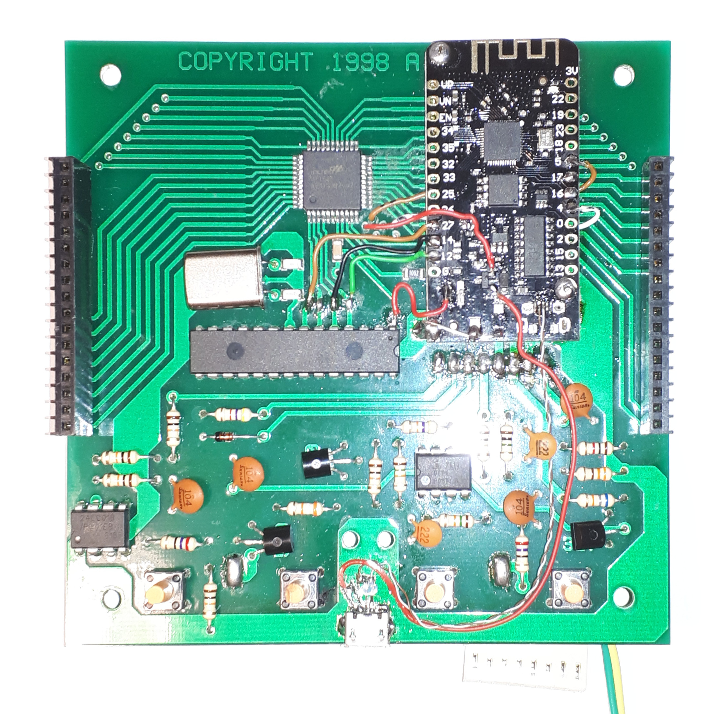
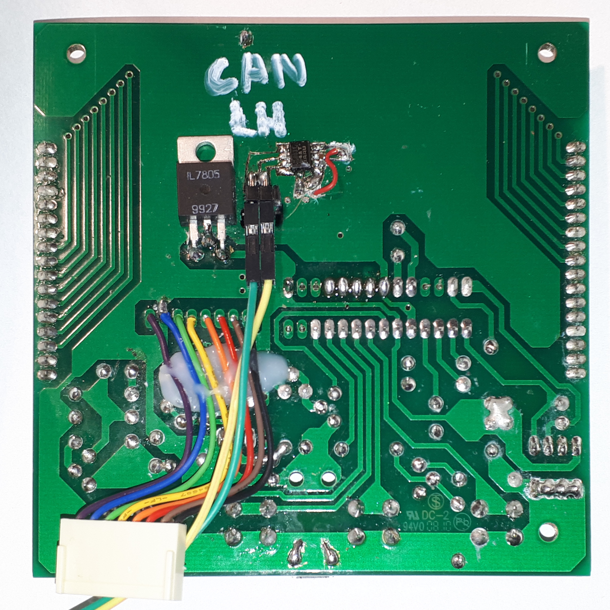

# __ClipperDuet2N2k__ documentation

This directory contains some pictures, as well as a [German HOWTO](HOWTO_de.md) with descriptions for less experienced users.

My own __ClipperDuet2N2k__ sandwiches an ESP32 board between LCD and the front PCB.

The cheapest ESP32 board I had laying around was used, this one even did not come with proper shielding (still good enough for this).

The USB port is only for development purposes. It is moved to the edge so that removal of LCD is not needed.

On the back of the PCB there is a L7805 linear voltage regulator. The smaller one on the front side was removed. This allows to power both Clipper and ESP32 stuff from one regulator. As this is a cheap hack, an old 78L05 was good enough.

The CAN transceiver was integrated on the board. This was achieved by manually cutting some traces for the SMD IC.
